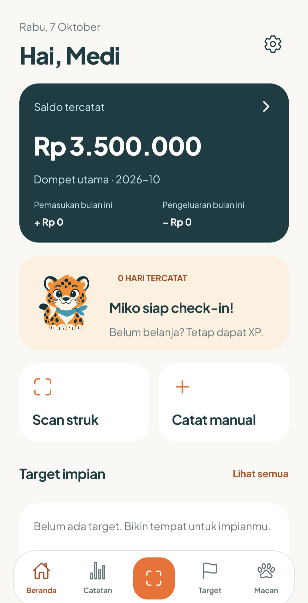
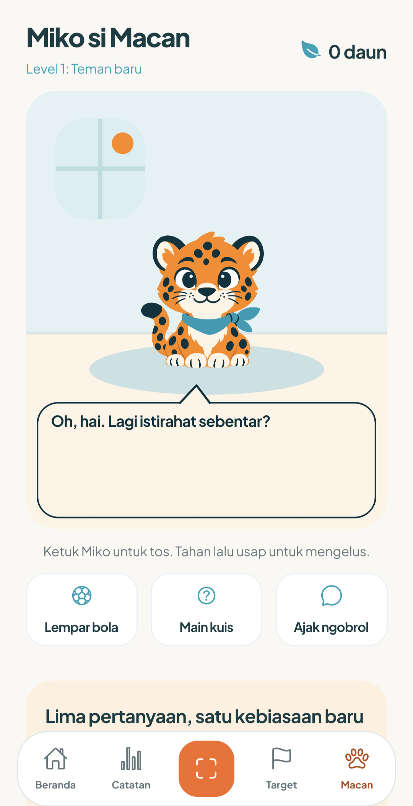
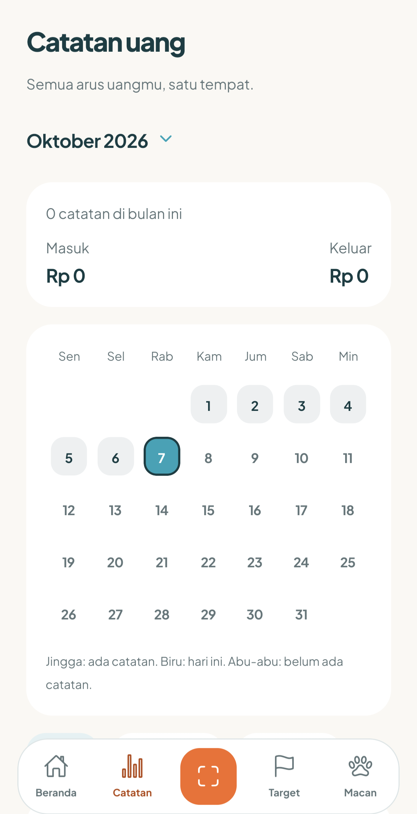

# MauCuan

Catat uang, bangun kebiasaan, dan tumbuh bareng Miko, teman macan tutulmu.

| Beranda | Miko | Catatan uang |
| :---: | :---: | :---: |
|  |  |  |

**[Download Android APK](https://github.com/medissl/MauCuan/releases/download/v0.4.2/MauCuan-0.4.2.apk)** · **[Website](https://maucuan-finance.vercel.app)** · [Semua versi](https://github.com/medissl/MauCuan/releases)

Versi **0.4.2**, build Android **9**. APK bisa dipasang langsung tanpa akun GitHub atau Expo. MauCuan belum tersedia di Play Store. Versi iOS belum dibagikan; APK hanya untuk Android.

## Mulai pakai

1. Buka link **Download Android APK** di ponsel Android dan unduh file `.apk`.
2. Buka file. Jika diminta, izinkan instalasi dari browser atau aplikasi yang kamu gunakan untuk mengunduhnya.
3. Pasang MauCuan, buat akun, lalu masukkan kode verifikasi dari email.
4. Isi nama kamu, nama macanmu, dan saldo awal uang yang ingin kamu pantau.

Kalau sudah memakai versi lama, instal APK baru sebagai pembaruan **tanpa menghapus aplikasi sebelumnya**. Update dibagikan lewat halaman Releases ini. Unduh file APK, bukan arsip “Source code”. [Panduan instalasi dan update](docs/download-android.md).

## Di dalam MauCuan

- Pemasukan dan pengeluaran dalam rupiah, kategori, edit/hapus transaksi, kalender catatan, dan ringkasan bulanan.
- Scan struk dari kamera atau galeri: pembacaan di perangkat, saran toko, tanggal, total, dan barang. Review hasil sebelum menyimpan; OCR tetap bisa keliru.
- Target tabungan dan alokasi saldo. MauCuan mencatat uang, bukan menyimpan atau memindahkannya.
- Miko yang bisa diajak ngobrol, tos, dielus, dan bermain bola; ekspresi dan kedekatan berkembang lewat kebiasaan.
- Check-in harian, XP, level, daun, aksesori, dan dekorasi kamar dengan satu barang per area. Belanja tambahan tidak menghasilkan XP tambahan.
- Kuis harian: lima pertanyaan dari bank 500 soal, tanpa mengulang pertanyaan dari tujuh hari sebelumnya, dengan hadiah daun.
- Pengingat kebiasaan dan widget Android, serta pengaturan untuk mengurangi gerakan.

## Untuk pengembang

Dibangun dengan Expo / React Native dan Supabase. Sumber aplikasi 0.4.2: [`57a030f`](https://github.com/medissl/MauCuan/commit/57a030f87c754a5e7c54ff2d01a482f8e1d72dee). Versi terbaru tersedia di branch `main`.

Gunakan Node.js 22+ dan npm. Salin `.env.example` menjadi `.env`, jalankan `npm ci`, lalu `npm start`. Modul OCR dan widget membutuhkan native build; Expo Go tidak mencakup semua fitur. Jangan memasukkan Supabase secret/service-role key ke aplikasi.

Pemeriksaan: `npm run typecheck`, `npm run lint`, `npm test`, dan `npm run export:android`. Untuk 0.4.2, semua 57 tes dan pemeriksaan tersebut lulus; hasil otomatis tidak menggantikan pengujian di ponsel.

Skema dan kebijakan akses tersimpan di `supabase/`. Data akun dibatasi ke pemiliknya melalui RLS; hadiah harian dan pembelian koleksi dihitung server. [Riwayat build](docs/android-preview.md) · [Catatan fitur 0.4.0](docs/release-0.4.0.md).

## Bantuan dan privasi

[Bantuan](https://maucuan-finance.vercel.app/support) · [Kebijakan privasi](https://maucuan-finance.vercel.app/privacy) · [Email bantuan](mailto:mediantozeng@gmail.com)

Catatan dan foto struk disimpan di backend Supabase setelah kamu menyimpannya. Aplikasi membutuhkan internet untuk akun dan penyimpanan. Jangan kirim kata sandi atau kode verifikasi saat meminta bantuan.

## Lisensi

MauCuan gratis untuk penggunaan pribadi. Source dan aset asli MauCuan **tidak dilisensikan sebagai open source**; penggunaan komersial, penjualan ulang, modifikasi, dan redistribusi memerlukan izin tertulis. Kamu tetap boleh membagikan link download resminya. Lihat [ketentuan lisensi](LICENSE).

Lisensi komponen pihak ketiga tetap berlaku, termasuk [template Expo](docs/licenses/expo-template-MIT.txt) dan [receipt reader](vendor/expo-text-extractor/NOTICE.md). Perubahan ini tidak mencabut hak yang sudah diberikan secara sah pada distribusi sebelumnya.
